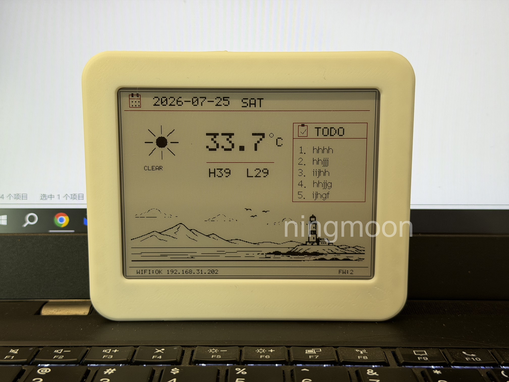
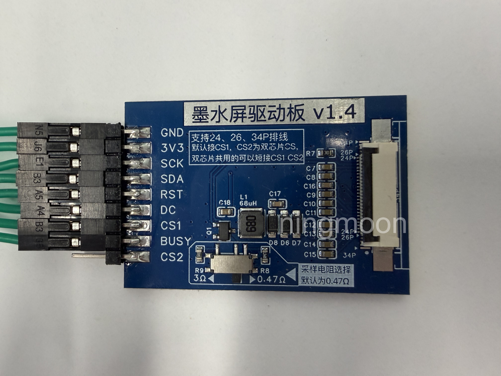
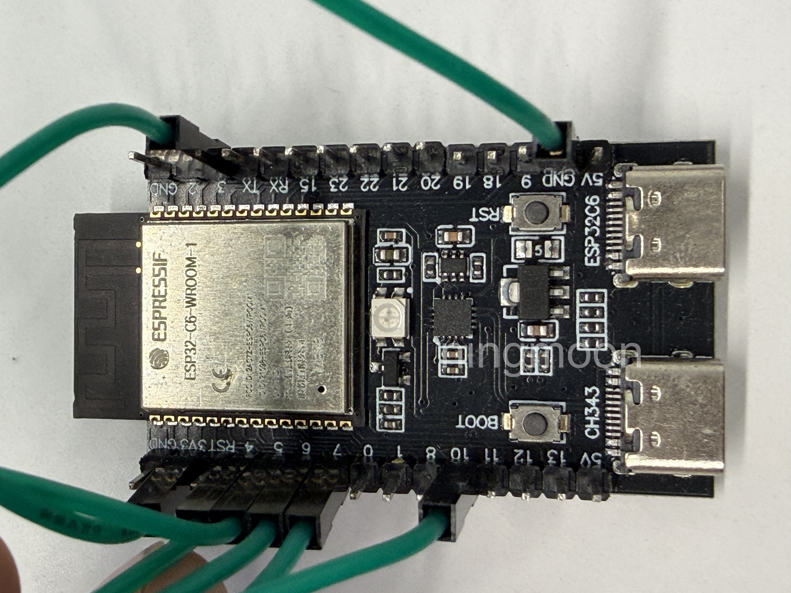

# ESP32-C6 电子纸信息看板

简体中文 | [English](README_EN.md)

这是一个基于 Arduino/PlatformIO 的 ESP32-C6 固件，用于驱动采用 SSD1619 兼容指令集的 400×300 三色电子纸屏。看板可显示时间、天气、最多五条待办事项、网络状态和由代码绘制的装饰图案，并通过设备内置网页完成配置。

成品可以安装在自行设计或选择的 3D 打印外壳中。下图仅展示开发阶段的实物效果；屏幕中的 AI 辅助生成装饰画面不作为可复用 bitmap 素材提供，也不代表当前公开固件的默认显示效果。



*安装 3D 打印外壳后的原型成品，仅供外观和应用场景展示。公开固件使用无外部素材依赖的程序化占位图。*

> 本项目目前针对下述开发板、转接板和屏幕组合配置。不同批次电子纸的控制器、BUSY 极性和刷新波形可能不同；编译成功不等于屏幕一定兼容。

## 快速开始

1. 按照[接线表](#接线)连接开发板、转接板和电子纸屏，确认使用 `3.3V` 供电。
2. 安装 Python 3 和 PlatformIO Core 6.x，通过 USB 数据线连接开发板的 CH343 串口/下载接口。
3. 编译、烧录并打开串口监视器：

   ```bash
   pio run -e esp32c6
   pio run -e esp32c6 -t upload
   pio device monitor -b 115200
   ```

4. 首次启动时连接 Wi-Fi 热点 `EPD-Config`，密码为 `12345678`，然后访问 <http://192.168.4.1>。
5. 填写 Wi-Fi、地点和刷新间隔，保存后设备会自动尝试连接 Wi-Fi，并更新天气和屏幕。
6. 从串口日志中找到设备的局域网 IP，之后可通过该 IP 再次打开配置页面。

首次编译会下载 `platformio.ini` 中声明的平台和依赖库。电子纸完整刷新需要一定时间，刷新期间不要断电或改动接线。

## 硬件

已配置的硬件组合：

- MuseLab nanoESP32-C6；
- 采用 SSD1619 兼容指令集的 400×300 三色电子纸屏；
- SPI 电子纸转接板，当前固件仅使用 `CS1`；
- USB 数据线、杜邦线和稳定的 3.3V 供电。

以下照片仅用于识别本项目使用的转接板和开发板接口，不代表当前固件的屏幕显示效果。

| SPI 电子纸转接板 | MuseLab nanoESP32-C6 |
|---|---|
|  |  |

### 接线

| 转接板引脚 | ESP32-C6 | 说明 |
|---|---:|---|
| GND | GND | 必须共地 |
| 3V3 | 3V3 | 不要接 5V |
| SCK | GPIO4 | SPI 时钟 |
| SDA | GPIO6 | 此转接板上的 `SDA` 用作 SPI MOSI |
| RST | GPIO10 | 屏幕复位 |
| DC | GPIO5 | 数据/命令选择 |
| CS1 | GPIO7 | 第一个片选 |
| BUSY | GPIO3 | 屏幕忙状态 |
| CS2 | 不连接 | 当前固件未使用 |

板载 RGB 状态灯使用 GPIO8，不需要额外接线。所有引脚和屏幕参数集中在 `include/board_config.h`，默认驱动配置为 `EPD_DRIVER_PROFILE 1`。

通电或刷新前，请再次核对屏幕排线方向、供电电压和接线。不要仅凭接口外观推断屏幕兼容性。

### 自定义装饰图片

看板底部预留的装饰区域位于 `(10, 186)`，尺寸为 **380×92 像素**。公开版本默认在 `src/epd_ui.cpp` 的 `draw_decorative_scene()` 中用线条绘制占位图，不包含任何外部 bitmap 素材。

驱动提供两个 1-bit bitmap 接口：

```cpp
epd_draw_black_bitmap(10, 186, black_bitmap, 380, 92);
epd_draw_color_bitmap(10, 186, color_bitmap, 380, 92);
```

- bitmap 按行存储，每行从最高位开始，每个置位像素绘制对应颜色。
- 宽度 380 像素时，每行需要 `(380 + 7) / 8 = 48` 字节；完整单色平面需要 `48 × 92 = 4416` 字节。
- 黑色和彩色分别使用独立的 1-bit 数据；未置位的区域保持白色。
- 可将数组声明为 `static const uint8_t ...[] PROGMEM`，然后在 `draw_decorative_scene()` 中调用上述接口。
- 请仅使用原创、公共领域，或许可证明确允许修改和再发布的图片。转换、缩放或抖动为 bitmap 不会自动取得原图版权。

## 首次配置

设备没有已保存的 Wi-Fi，或连接已有 Wi-Fi 失败时，会启动配置热点：

- 热点名称：`EPD-Config`
- 热点密码：`12345678`
- 配置地址：<http://192.168.4.1>

配置页面包含以下内容：

- **Wi-Fi SSID / Password**：设备需要连接的无线网络；密码输入框留空时保留原密码。
- **City**：屏幕上显示的地点名称；天气查询实际使用下面的经纬度。
- **Latitude / Longitude**：天气位置，请将默认的 `0, 0` 改为实际坐标。
- **Weather update min**：天气更新间隔，单位为分钟。
- **Screen update min**：屏幕刷新间隔，单位为分钟。
- **AP mode always on**：保持配置热点常开。一般家庭网络中建议关闭。
- **Todo Items**：最多保存五项；受屏幕空间限制，每项目前只显示前 5 个字符。
- **Refresh screen**：请求一次手动刷新；实际刷新由主循环执行，页面返回后屏幕可能仍需等待片刻。

保存主配置后，设备会自动尝试重新连接 Wi-Fi，无需立刻手动复位。如果首次启动时已经开启了配置热点，取消勾选 **AP mode always on** 不会立即关闭现有热点；确认 Wi-Fi 连接成功后重启设备，后续正常连接时热点便不会启动。

当前固件在 `src/main.cpp` 中将显示时区固定为 **UTC+8**。中国标准时间以外的用户需要修改 `configTime()` 的 UTC 偏移并重新编译。天气接口使用经纬度自动确定天气数据的时区，但不会改变看板时钟的固定 UTC+8 设置。

## 日常使用

- 串口波特率为 `115200`，启动日志会输出 Wi-Fi 状态、局域网 IP 和错误信息。
- 在同一局域网内访问设备 IP，可以修改配置、待办事项或请求手动刷新。
- `http://<设备IP>/api/status` 返回当前连接、天气、时间和刷新状态。
- 配置和待办事项保存在 ESP32 Preferences/NVS 中，重启后仍会保留。

### 天气数据与使用范围

天气数据由 [Open-Meteo.com](https://open-meteo.com/) 提供，并按 [CC BY 4.0](https://creativecommons.org/licenses/by/4.0/) 使用。固件在电子纸底部显示 `OPEN-METEO.COM`，配置页面也提供可点击的署名链接。

本项目的源代码继续采用 MIT 许可证，本身允许商业使用；Open-Meteo API 是独立的在线服务，其服务条款不会改变本项目源代码的许可证。Open-Meteo 当前的免费/Open-Access API 仅允许非商业使用，并设有调用量限制。本项目默认配置面向个人、家庭自动化和其他非商业用途。商业部署应按其最新条款订阅商业 API，或修改代码使用具有相应授权的其他天气服务。

## 常见问题

### 找不到串口或无法烧录

确认使用的是 USB 数据线而不是仅供电线，并检查 CH343 驱动。可先运行 `pio device list` 查找端口；自动识别失败时显式指定端口，例如：

```bash
pio run -e esp32c6 -t upload --upload-port COM3
pio device monitor --port COM3 -b 115200
```

请将示例中的 `COM3` 替换为实际端口。

### 无法打开配置页面

确认电脑或手机仍连接到 `EPD-Config`，然后直接访问 <http://192.168.4.1>。部分设备会提示该热点无法访问互联网，这是正常现象。如果设备已经连接家庭 Wi-Fi，请改用串口日志中显示的局域网 IP。

### 天气位置不正确

`City` 只是显示名称。请检查经纬度是否正确，尤其注意南纬和西经应使用负数。

### 屏幕无显示或颜色异常

立即断电并重新检查 3.3V、GND、SCK、SDA/MOSI、CS1、DC、RST 和 BUSY。不同屏幕即使分辨率相同，也可能需要不同的驱动配置、BUSY 极性或波形，不要反复刷新未经确认兼容的屏幕。

## 功能与代码结构

- 连接 Wi-Fi，并在需要配置时启动本地 AP。
- 使用 ESP32 Preferences/NVS 保存 Wi-Fi、地点、刷新间隔和待办事项。
- 无需 API Key，从 Open-Meteo 获取天气，并提供本地配置页面和 `/api/status`。
- 使用黑色和彩色双缓冲区绘制界面；耗时的电子纸刷新仅在主循环中执行。
- 非阻塞地驱动板载 RGB 状态灯。

`src/main.cpp` 负责协调 Wi-Fi、NTP 校时、天气、Web 服务及屏幕刷新。配置和运行状态定义在 `include/app_config.h`、`include/app_state.h`；持久化、网络、显示和状态灯的实现在 `src/` 中相应的文件里。

## 验证与贡献

```bash
pio run -e esp32c6 -t clean
pio run -e esp32c6
```

目前没有主机端单元测试。实物测试建议覆盖启动、配置 AP、NVS 重新加载、Wi-Fi 重连、NTP、天气请求、Web 路由、状态灯和至少一次完整刷屏。请将 GPIO 定义集中在 `include/board_config.h`，在主循环中执行屏幕刷新，并在修改驱动时记录实际使用的开发板、转接板和屏幕型号。

请勿提交凭据、日志、私人位置、厂商文档，或未经记录来源及兼容许可证的外部素材和代码。

## 安全与隐私

本项目是可信局域网内的原型，不应直接暴露到互联网。配置热点密码公开且固定在 `src/wifi_manager.cpp` 中；实际部署时应修改。配置页面使用无身份验证、无 CSRF 防护的 HTTP：不要开放路由器的 80 端口、建立公网隧道，或把设备接入不可信网络。

Wi-Fi 密码存储在 NVS 中，并非硬件安全存储。天气请求使用 HTTP，响应未认证，网络也可看到请求中的坐标；对安全要求较高时应改用经过验证的 TLS。串口日志可能包含 IP 等运行信息，提交公开问题时不要附上真实凭据或设备标识。

发布目录中的默认配置为合成数据，`.pio/` 编译产物已被忽略。公开发布前仍应检查本地文件和 Git 暂存区；自动扫描不能证明代码或素材的法律来源，也无法覆盖后续新增文件。

## 依赖与许可证

依赖由 PlatformIO 下载，仓库不随附第三方库源码：pioarduino `espressif32`/Arduino ESP32（平台版本 `55.03.39`）、ArduinoJson 7.4.3（MIT）、[Adafruit GFX 1.12.6](https://github.com/adafruit/Adafruit-GFX-Library/blob/master/license.txt)（BSD）、[U8g2 for Adafruit GFX 1.8.0](https://github.com/olikraus/u8g2_for_Adafruit_GFX/blob/master/LICENSE)（库代码 BSD-2-Clause），以及间接依赖 Adafruit BusIO（MIT）。第三方依赖仍遵循其上游许可证。

待办事项中的中文字符使用 `u8g2_font_wqy16_t_gb2312`。U8g2 的[字体来源说明](https://github.com/olikraus/u8g2/wiki/fntgrpwqy)将其归于文泉驿项目（2004–2010，WenQuanYi Project Board of Trustees 和 Qianqian Fang），标注为 **GPL v2，附字体嵌入例外**，并非上面库代码的 BSD；参见 [NOTICE](NOTICE)。仓库不直接包含该字体源文件，但编译固件会包含相应字体数据。分发二进制前，应单独核实字体嵌入例外是否涵盖具体分发方式，以及需要随固件提供哪些许可证或源码材料。本项目的 MIT 许可证不会重新许可该字体。

项目原创代码及原创文档以 [MIT License](LICENSE) 开源，版权署名为 Copyright 2026 ningmoon，另见 [NOTICE](NOTICE)。对于 `docs/` 中由 ningmoon 拍摄的照片，仅其中由 ningmoon 创作并实际拥有权利的部分作为项目文档按 MIT 许可证提供；原型照片中由 AI 辅助生成的屏幕装饰画面仅供展示，不单独作为素材发布或主张排他性版权。仓库不包含厂商资料、下载的 SDK、私人开发历史、成品装饰 bitmap 或编译产物；当前装饰图案由 `src/epd_ui.cpp` 中的绘图代码生成。
